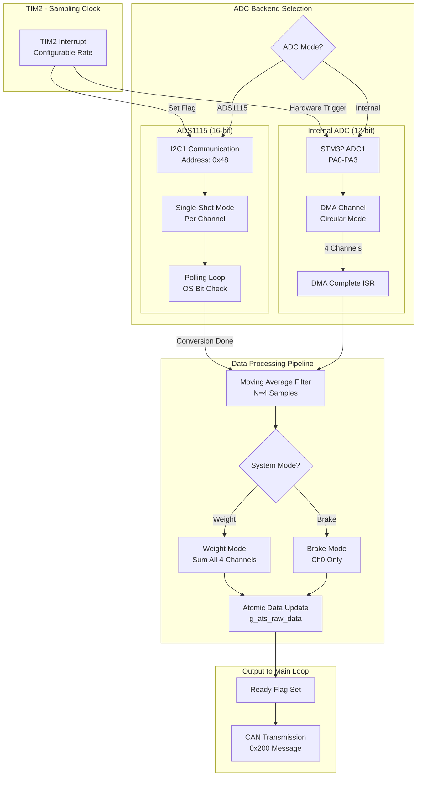

# ADC System - Complete Knowledge Base

## Overview
The ATS Two-Wheeler firmware implements a **Dual-Mode ADC System** with automatic mode switching, moving average filtering, and system mode optimization for Weight vs Brake measurements.

**Key Features:**
- **Dual ADC Backend**: Internal 12-bit (DMA) + ADS1115 16-bit (I2C)
- **4-Channel Acquisition**: Ch0-Ch3 (Load Cells or Brake Sensor)
- **Moving Average Filter**: N=4 samples for noise reduction
- **System Modes**: Weight (all channels) vs Brake (Ch0 only)
- **Timer-Triggered**: Configurable sampling rates (1Hz - 1kHz)

---

## Architecture Diagram



---

## 1. ADC Mode Selection

### 1.1 Internal ADC (12-bit) - Mode 0

**Hardware:**
- **Peripheral**: STM32F302 ADC1
- **Channels**: 4 (PA0, PA1, PA2, PA3)
- **Resolution**: 12-bit (0-4095 per channel)
- **Trigger**: TIM2 TRGO (Hardware)
- **DMA**: Circular mode, 4-element buffer

**Characteristics:**
- **Sampling Rate**: Up to 1 kHz (limited by timer)
- **Data Type**: Unsigned `uint16_t` (0-16380 for 4 channels summed)
- **Latency**: ~1 µs per channel (DMA-driven, zero CPU overhead)
- **Noise**: Moderate (12-bit quantization)

**Initialization Sequence:**
1. Initialize the ADC peripheral.
2. **Critical Step:** Run self-calibration (Required for STM32F3 series).
3. Configure all 4 channels with appropriate sampling time.
4. set Timer frequency to 1kHz.
5. Start DMA in circular mode for continuous acquisition.

**Data Flow:**
```
TIM2 Trigger → ADC1 Conversion (4 channels) → DMA Transfer → 
HAL_ADC_ConvCpltCallback() → Process_ADC_Data() → 
Apply Filter → Update g_ats_raw_data
```

---

### 1.2 ADS1115 (16-bit) - Mode 1

**Hardware:**
- **IC**: Texas Instruments ADS1115
- **Interface**: I2C1 (Address: 0x48)
- **Channels**: 4 (AIN0-AIN3 to GND)
- **Resolution**: 16-bit signed (-32768 to +32767)
- **PGA**: ±4.096V range

**Characteristics:**
- **Sampling Rate**: Up to 250 Hz (limited by I2C + 4-channel sequential read)
- **Data Type**: Signed `int16_t` (-131072 to +131068 for 4 channels summed)
- **Latency**: ~1.2 ms per channel (I2C overhead + conversion time)
- **Noise**: Low (16-bit precision)

**Single-Shot Conversion Cycle:**
```c
1. Write Config Register (Set MUX, Start Conversion)
   - OS = 1 (Start)
   - MUX = Channel (0x4000 + channel << 12)
   - PGA = ±4.096V (0x0200)
   - MODE = Single-Shot (0x0100)
   - DR = 860 SPS (0x00E0)

2. Poll Config Register (Wait for OS bit = 1)
   - Timeout: 10ms
   - Typical: 1.2ms @ 860 SPS

3. Read Conversion Register (16-bit result)
```

**Data Flow:**
```
TIM2 ISR → Set g_ads1115_read_pending Flag → 
Main Loop Detects Flag → ADS1115_Read_Channel() → 
Single-Shot Conversion → Apply Filter → 
Update g_ats_raw_data
```

**Why Single-Shot Mode?**
> Continuous mode was removed because MUX switching in continuous mode requires strict timing synchronization. Stale/swapped channel data was observed when switching MUX while in continuous mode. Single-shot guarantees fresh data per channel.

---

## 2. Moving Average Filter

**Purpose**: Reduce high-frequency noise and sensor jitter.

**Implementation:**
- **Filter Size**: 4 samples (configurable via `ADC_FILTER_SAMPLES`)
- **Type**: Simple Moving Average (SMA)
- **Buffers**: Per-channel circular buffers

**Algorithm:**
The filter adds each new sample to a circular buffer. It then calculates the arithmetic mean of all samples currently in the buffer (up to 4) to produce the filtered output.

**Filter Reset Conditions:**
1. **Mode Switch** (Internal ↔ ADS1115): Prevents cross-contamination
2. **System Mode Switch** (Weight ↔ Brake): Prevents old sensor data corruption

---

## 3. System Modes (Weight vs Brake)

### 3.1 Weight Mode (SYSTEM_MODE_WEIGHT = 0x00)

**Purpose**: Measure total vehicle weight using 4 load cells.

**Channel Usage:**
- **Ch0**: Front-Left Load Cell
- **Ch1**: Rear-Left Load Cell
- **Ch2**: Front-Right Load Cell
- **Ch3**: Rear-Right Load Cell

**Calculation:**
```c
total_raw = Ch0 + Ch1 + Ch2 + Ch3
```

**Relay State**: OFF (PB12 = LOW)

**ADS1115 Sampling Rate**: ~100 Hz (4 channels × 1.2ms = 4.8ms per cycle)

---

### 3.2 Brake Mode (SYSTEM_MODE_BRAKE = 0x01)

**Purpose**: Measure brake force using single sensor (high-speed).

**Channel Usage:**
- **Ch0**: Brake Force Sensor (via Relay)
- **Ch1-Ch3**: Ignored (not read in ADS1115 mode)

**Calculation:**
```c
total_raw = Ch0 // Only Ch0 is valid
```

**Relay State**: ON (PB12 = HIGH)

**ADS1115 Sampling Rate**: ~800 Hz (1 channel × 1.2ms = 1.2ms per cycle)

**Optimization:**
> In Brake Mode with ADS1115, only Ch0 is read to maximize sampling rate. This "Turbo Mode" achieves 4x faster updates compared to Weight Mode.

**Relay Settling Time:**
- **Duration**: 20ms (defined in `RELAY_SETTLING_TIME_MS`)
- **Purpose**: Allow mechanical relay bounce to settle before first ADC read

---

## 4. Timer-Triggered Sampling

**Timer**: TIM2 (configured via `tim.c`)

**Supported Rates:**
| Rate Code | Frequency | Period | Use Case |
|:---|:---|:---|:---|
| `0x05` | 1 Hz | 1000 ms | Slow monitoring |
| `0x01` | 100 Hz | 10 ms | Standard logging |
| `0x02` | 500 Hz | 2 ms | Fast logging |
| `0x03` | 1 kHz | 1 ms | Real-time control |

**Configuration:**
The timer is configured to trigger an interrupt at the selected frequency (default 1kHz) and started immediately upon ADC initialization.

**Internal ADC Mode:**
- Timer TRGO directly triggers ADC hardware
- Zero CPU intervention
- DMA transfers data automatically

**ADS1115 Mode:**
- Timer ISR sets `g_ads1115_read_pending` flag
- Main loop polls flag and performs I2C read
- Blocking I2C operation (~1.2ms per channel)

---

## 5. Data Structures

### 5.1 ATS_Raw_Data_t (Output Structure)

### 5.1 ATS_Raw_Data_t (Output Structure)
The system uses a unified structure to report status:
- `total_raw`: Sum of all 4 channels (or Ch0 in Brake Mode).
- `chX_raw`: Individual channel values (for debugging).
- `ready`: Flag indicating new data is available.
- `streaming`: Flag indicating CAN streaming status.
- `adc_mode`: Current active backend (0=Internal, 1=External).

---

### 5.2 Internal Buffers
- **DMA Buffer**: A private, 4-element array used by the DMA controller to store the latest raw ADC conversion results.
- **Filter Buffers**: A 2D array (4 channels × N samples) used to store historical data for the moving average filter. An index tracks the current position in the circular buffer.

---

## 6. Interrupt Service Routines

### 6.1 TIM2 Period Elapsed Callback
When the timer period elapses:
1. Check if the interrupt source is TIM2.
2. If in **ADS1115 Mode**: Set `g_ads1115_read_pending` flag to notify the main loop.
3. If in **Internal ADC Mode**: Do nothing (Hardware TRGO handles triggering automatically).

**Execution Time**: <1 µs (flag set only)

---

### 6.2 ADC DMA Complete Callback
When the DMA transfer completes (buffer full):
1. Check if the source is ADC1.
2. Call `Process_ADC_Data()` to apply filters and sum the channels.

**Execution Time**: ~10 µs (filter + sum + atomic update)

**Critical Section**: Interrupts are temporarily disabled (`__disable_irq`) during the atomic data update to prevent race conditions.

---


## 8. Timing Analysis

### 8.1 Internal ADC Mode (1kHz)

| Event | Time | CPU Load |
|:---|:---|:---|
| TIM2 Trigger | 0 µs | 0% |
| ADC Conversion (4 ch) | 0-80 µs | 0% (DMA) |
| DMA Transfer | 80 µs | 0% (DMA) |
| DMA ISR Entry | 80 µs | - |
| Filter + Sum | 80-90 µs | 100% |
| Atomic Update | 90-91 µs | 100% |
| **Total CPU Time** | **~11 µs** | **1.1%** |

---

### 8.2 ADS1115 Mode (250Hz)

| Event | Time | CPU Load |
|:---|:---|:---|
| TIM2 ISR (Flag Set) | 0 µs | <1 µs |
| Main Loop Poll | Variable | - |
| I2C Write (Config) | 0-200 µs | 100% |
| ADS1115 Conversion | 200-1400 µs | 0% (External) |
| I2C Poll (OS Bit) | 1400-1600 µs | 100% |
| I2C Read (Result) | 1600-1800 µs | 100% |
| Filter + Sum | 1800-1810 µs | 100% |
| **Total CPU Time** | **~600 µs** | **15%** |

**Note**: ADS1115 mode is blocking during I2C operations. Main loop cannot process other tasks during this time.

---

## 9. Error Handling

### 9.1 Error Codes

| Code | Meaning | Recovery |
|:---|:---|:---|
| `ERROR_ADC_CONVERSION_FAILED` | ADC init/calibration failed | Retry init |
| `ERROR_ADS1115_I2C_ERROR` | I2C communication timeout | Check wiring, retry |
| `ERROR_ADS1115_TIMEOUT` | Conversion timeout (>10ms) | Retry, check ADS1115 power |
| `ERROR_CAL_INVALID_MODE` | Invalid ADC mode parameter | Fix caller code |

### 9.2 Automatic Recovery

**ADC DMA Error:**
If the hardware reports an ADC overflow or DMA error (via `HAL_ADC_ErrorCallback`), the system automatically attempts to restart the DMA process to recover functionality without a full reset.

**ADS1115 I2C Error:**
- Stored in `g_last_ads_err` (diagnostic variable)
- Returned to caller for handling
- No automatic retry (caller decides)

---

## 10. Debugging & Monitoring

### 10.1 Live Expressions (STM32CubeIDE)

Add these variables to watch real-time ADC performance:

| Variable | Type | Description | Expected Value |
|:---|:---|:---|:---|
| `g_current_mode` | `ADC_Mode_t` | Active ADC backend | 0 (Internal) or 1 (ADS1115) |
| `g_system_mode` | `ADC_System_Mode_t` | Weight/Brake mode | 0 (Weight) or 1 (Brake) |
| `g_adc_sample_count` | `uint32_t` | Total samples acquired | Increasing |
| `g_ats_raw_data.total_raw` | `int32_t` | Latest combined value | 0-16380 (Int) or ±131072 (ADS) |
| `g_ats_raw_data.ready` | `uint8_t` | New data flag | 0 or 1 |
| `g_last_ads_err` | `Error_Code_t` | Last ADS1115 error | 0 (ERROR_NONE) |
| `adc_dma_buffer[0-3]` | `uint16_t[4]` | Raw DMA values | 0-4095 each |

---

### 10.2 Performance Metrics

**Sample Rate Calculation:**
The main control loop calculates the effective sample rate every second by comparing the `g_adc_sample_count` variable against its value from the previous second.

**Expected Rates:**
- Internal ADC @ 1kHz: ~1000 Hz
- ADS1115 @ 250Hz (Weight): ~100 Hz (4 channels)
- ADS1115 @ 250Hz (Brake): ~250 Hz (1 channel)

---

## 11. Best Practices

### 11.1 Mode Switching
Always ensure the previous mode is fully de-initialized before starting a new one. When switching to ADS1115, allow a small settling time for the internal filters to stabilize before trusting the data.

### 11.2 System Mode Switching
1. **Switch Relay First**: Change the GPIO state for the relay.
2. **Wait for Settling**: Allow 20ms for mechanical bounce to stop.
3. **Switch Logic Mode**: Only then update the software mode variable.
4. **Reset Filters**: Clear all historical data buffers to prevent "Weight" data from corrupting "Brake" readings.

### 11.3 Sampling Rate Selection
- **Internal ADC (1kHz)**: Use for real-time control loops where latency matters most.
- **ADS1115 (100Hz)**: Use for high-precision weight measurement where stability is key.
- **ADS1115 (1Hz)**: Use for slow monitoring or idle states to save bus bandwidth.

