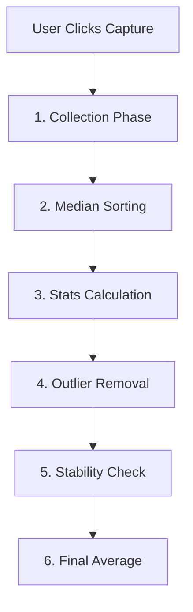

# Calibration Subsystem - Logic Guide

## Overview
This document details the internal logic of the Calibration Engine. It explains **exactly** how the system converts raw ADC values into physical weight, including the mathematical formulas and signal processing steps used to ensure accuracy.

---

## 1. The Math: Linear Regression (Global Fit)

Instead of a simple "Two-Point" calibration (which assumes a perfect sensor), we use **Least Squares Linear Regression**. This allows you to take many points (0kg, 10kg, 20kg, 50kg...) and find the "Line of Best Fit".

### 1.1 The Equation
The system calculates two constants, **Slope ($m$)** and **Intercept ($c$)**, to solve the linear equation:

**Equation:**
`Weight = (m * RawADC) + c`

### 1.2 Algorithm (Least Squares)
When you click "Calibrate", the system runs this algorithm on your data points:

1.  **Summation**: Calculates sums of `x` (ADC), `y` (Weight), `xy`, and `x^2`.
2.  **Slope (m) Calculation**:
    ```text
    m = (n * Sum(xy) - Sum(x) * Sum(y)) / (n * Sum(x^2) - Sum(x)^2)
    ```
3.  **Intercept (c) Calculation**:
    ```text
    c = (Sum(y) - m * Sum(x)) / n
    ```
4.  **Quality Check (R²)**:
    *   Calculates how close the points are to the line.
    *   **1.0** = Perfect (All points on the line).
    *   **< 0.99** = Poor (Sensor is non-linear or noisy).

---

## 2. Capture Logic: The "Anti-Noise" Pipeline

When you click "Capture Point", the system doesn't just take one value. It enters a **6-Stage Signal Processing Pipeline** to guarantee a stable reading.



### Stage 1: Collection
*   **Action**: Collects N samples (Default: 50) over T ms (Default: 2000ms).
*   **Logic**: Fills a buffer with raw data at 100Hz.

### Stage 2: Median Sorting (Optional but Recommended)
*   **Problem**: A dropped wrench or table bump causes a massive spike (e.g., 5000kg).
*   **Logic**: Sorts all 50 samples from lowest to highest.
*   **Why**: The "middle" value is immune to momentary spikes.

### Stage 3: Stats Calculation
*   Calculates the **Mean** (Average) and **Standard Deviation** (Spread) of the raw buffer.

### Stage 4: Outlier Removal (Sigma Clipping)
*   **Action**: Deletes any sample that is too far from the average.
*   **Threshold**: defined by `Outlier Threshold` setting (Default: 2.0 Sigma).
*   **Formula**:
    ```text
    If |Sample - Mean| > (2.0 * Sigma) -> DELETE
    ```
*   **Result**: Removes random noise spikes that passed the Median filter.

### Stage 5: Stability Check
*   **Logic**: Checks if the *remaining* Standard Deviation is below `Max Std Dev` (Default: 10.0).
*   **Fail**: If `Sigma > 10.0`, shows a "Unstable Reading" warning. You might have a loose wire.
*   **Pass**: Proceed to final calculation.

### Stage 6: Final Average
*   **Logic**: Takes the arithmetic mean of the *cleaned* list (outliers removed).
*   **Result**: This single integer becomes the `RawADC` for that calibration point.

---

## 3. Dual-Mode Capture Logic

The system supports two hardware paths: **Internal ADC** and **ADS1115**. Since they have different resolutions (12-bit vs 16-bit), one calibration point needs **two** raw values.

**The Workflow:**
1.  **Capture Mode A**:
    *   System reads 50 samples from the *currently active* ADC (e.g., Internal).
    *   Stores result as `Internal_Raw`.
2.  **Auto-Switch**:
    *   System sends CAN Command `0x050` to switch hardware mux.
    *   Waits 500ms for settling.
3.  **Capture Mode B**:
    *   System reads 50 samples from the *new* ADC (e.g., ADS1115).
    *   Stores result as `ADS1115_Raw`.
4.  **Restore**:
    *   System switches back to the original mode.

**Why?** This ensures that if you switch settings later (e.g., improve hardware), your calibration remains valid because you captured data for *both* chips simultaneously.

---

## 4. Troubleshooting Codes & Metrics

### 4.1 R-Squared (Coefficient of Determination)
*   **Logic**: Represents "Linearity".
*   **Good (> 0.999)**: Your load cells are healthy and mounted correctly.
*   **Bad (< 0.99)**: Something is bending, rubbing, or the sensor is damaged.

### 4.2 Max Error %
*   **Logic**: Checks the worst-case deviation.
*   **Formula**: `MAX( |Actual - Predicted| / Actual )` for all points.
*   **Rule**: Should be < 0.1% for a legal-for-trade scale.

### 4.3 Outliers Removed
*   **Logic**: Count of samples deleted in Stage 4.
*   **High Count (> 5)**: Your environment is very noisy (vibrations). Check grounding or mountings.
