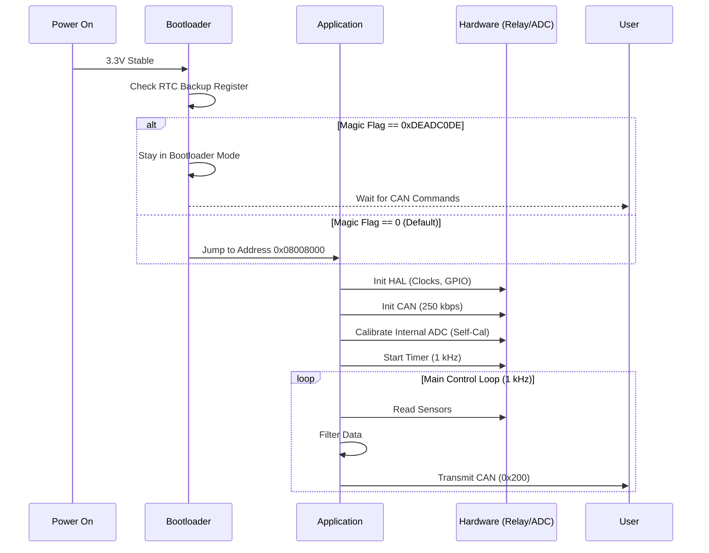
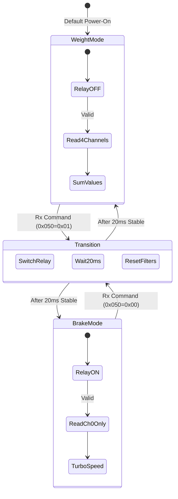
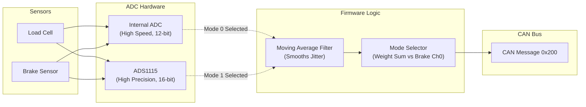
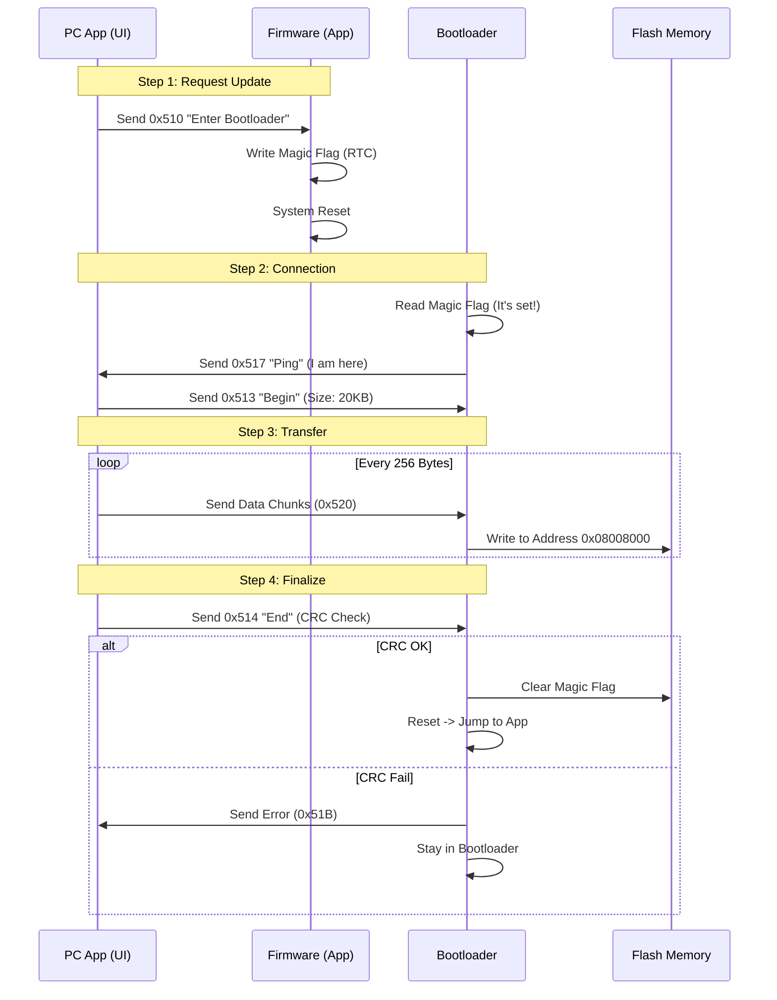

# ATS Two-Wheeler System: Logic & Flows

## Overview
This document visualizes the core logic and behavioral flows of the system. It is designed to explain *how* the system works conceptually, bridging the gap between hardware behavior and software logic.

---

## 1. System Startup Sequence
**Goal:** Ensure safe power-up, check for updates, and initialize sensors.

---

## 2. Weight vs. Brake Mode Switching
**Goal:** Switch physical hardware (Relay) and software logic safely.

**Key Logic:**
1.  **Relay Switching**: Physical relays take time to move (~5-10ms). We wait **20ms** to be safe.
2.  **Filter Reset**: Switching modes changes the signal drastically. We must clear old "Weight" data before processing "Brake" data to avoid spikes.

---

## 3. ADC Data Pipeline
**Goal:** Convert analog voltage to clean, usable weight data.

**Concept:**
The system uses a **Dual-Backend** architecture. The main application logic doesn't care which hardware is used; it just asks for "Total Raw Data".

---

## 4. Firmware Update Process (Bootloader)
**Goal:** Update the application firmware in the field without special hardware.

**Logic:**
The update is a handshake process. The PC tells the STM32 to restart, the STM32 waits for data, and then writes it to flash memory.

---

## 5. Troubleshooting Logic
**Goal:** Diagnose common field issues.

```mermaid
graph TD
    Start[Issue: No Data in UI] --> LED{Status LED Blinking?}
    
    LED -->|No| Power[Check Power 3.3V]
    LED -->|Yes| CAN{Check CAN Bus}
    
    CAN -->|PCanView Empty| Term[Check 120Ω Resistors]
    CAN -->|PCanView Shows Error| Baud[Check Baud Rate 250k]
    CAN -->|PCanView Shows Data| UI[Check UI Settings]
    
    UI -->|Wrong Adapter| Sel[Select Correct Adapter]
    UI -->|Wrong Mode| Mode[Check Weight/Brake Mode]
```

