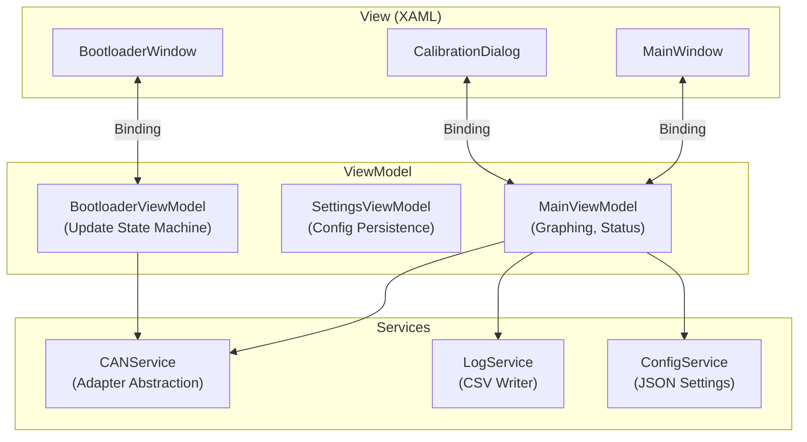
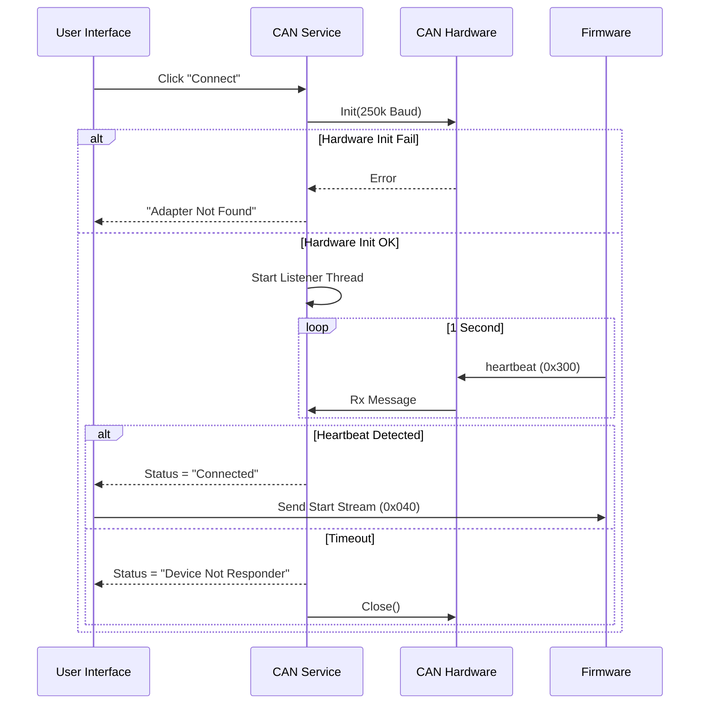
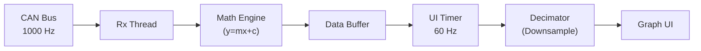

# PC Application (UI) - Knowledge Base

## Overview
The ATS Two-Wheeler PC Application is a WPF-based control interface designed for engineers and QA. It acts as the "Command Center" for the system, handling data visualization, calibration, and firmware updates.

**Key Features:**
- **Real-Time Graphing**: Visualizes ADC data at up to 1kHz.
- **Auto-Detection**: Scans for valid CAN adapters and device heartbeats.
- **Calibration Engine**: Performs 2-point linear calibration (Tare + Span).
- **Bootloader Manager**: Orchestrates safe firmware updates.
- **Data Logging**: Records sessions to CSV for analysis.

---

## 1. System Architecture (MVVM)
The application follows the **Model-View-ViewModel (MVVM)** pattern to separate UI logic from business logic.

---

## 2. Connection Logic
The application abstracts the physical hardware (PCAN-USB or USB-CAN) into a unified "Connection" concept.

**Connection Flow:**
1.  **Scan Phase**: Check for available adapters (PCAN-Basic API or Serial Ports).
2.  **Open Phase**: Initialize the selected channel at **250 kbps**.
3.  **Validation Phase**: Listen for "Heartbeat" messages (`0x300` System Status) for 1 second.
    *   If `0x300` received → **Connected**.
    *   If Timeout → **Error/Retry**.

---

## 3. Settings & Configuration Logic
The UI provides various settings to tune performance and behavior. These are saved to `settings.json`.

### 3.1 Connection Settings
- **Adapter Type**: Selects the driver backend.
  - *PCAN-USB*: Uses `PCANBasic.dll`. Industry standard, reliable.
  - *USB-CAN-A*: Uses generic `SerialPort`. Requires specific COM port selection.
  - *Simulator*: Connects to the local software simulator loopback.
- **COM Port**: (Serial only) Physical port where the adapter is plugged in.
- **Baud Rate**: Fixed at **250 kbps** to match firmware hardcoding.

### 3.2 Performance Settings
High-speed data (1000 points/sec) can overwhelm standard UI rendering.
- **Max Graph Points**: Defines the window size.
  - *Low (1,000)*: Fast updates, "Oscilloscope" view.
  - *High (10,000)*: History view, higher CPU usage.
- **Downsampling Factor**: Visual compression ratio (Decimation).
  - *1:1*: Draw every point (High CPU).
  - *1:10*: Draw every 10th point (Low CPU). Visually identical for high-frequency signals.

### 3.3 Logging Settings
- **Enable Logging**: Logic switch to start/stop CSV writing.
- **Log Directory**: Target folder. Defaults to `My Documents/ATS_Logs`.
- **Auto-Split**: Files are automatically rotated every 1 hour to prevent massive file sizes.

---

## 4. Calibration & Mode Logic

### 4.1 Weight Mode vs. Brake Mode
The UI maintains **two separate calibration profiles**. This is critical because the physical sensors are different.

| Feature | Weight Mode | Brake Mode |
| :--- | :--- | :--- |
| **Sensor** | 4 Load Cells (Summed) | 1 Brake Force Sensor |
| **Physical Unit** | Kilograms (kg) | Newtons (N) |
| **Calibration** | Profile A (Slope_W, Offset_W) | Profile B (Slope_B, Offset_B) |
| **Logic** | Sends `0x050` payload `0x00` | Sends `0x050` payload `0x01` |

**Switching Logic:**
1. User selects "Brake Mode" in UI dropdown.
2. UI sends CAN Command `0x050` (Mode Switch).
3. UI immediately **swaps the active calibration slope/offset** in memory.
4. Future incoming data is multiplied by the new Slope_B.

### 4.2 Calibration Process (Tare & Span)
The math engine follows a standard linear regression logic: `y = mx + c`.

**Step 1: Tare (Finding Offset 'c')**
1. User clicks "Tare".
2. UI takes the average of the last 100 received raw samples (to filter noise).
3. Logic: `Offset = Average_Raw`.
4. Result: Displayed value becomes `0.0`.

**Step 2: Span (Finding Slope 'm')**
1. User places a known test weight (e.g., 50.0 kg).
2. User enters "50.0" in the Calibration Dialog and clicks "Calibrate".
3. UI takes average of last 100 samples to get `Current_Raw`.
4. Logic: `Slope = Known_Weight / (Current_Raw - Offset)`.
5. Save `Slope` and `Offset` to `settings.json`.

---

## 5. Graphing Pipeline
Handling 1kHz data (1000 points/sec) requires an optimized pipeline to prevent UI freezing.

**Pipeline Stages:**
1.  **Ingestion**: Background thread receives CAN message `0x200`.
2.  **Parsing**: Raw bytes converted to `int32`.
3.  **Calibration**: Equation applied to get `double` weight.
4.  **Buffering**: Point added to a thread-safe circular buffer.
5.  **Decimation (10:1)**: (Optional)
    *   The UI updates at **60 FPS** (approx 16ms refresh).
    *   Drawing 1000 points/sec is wasteful for pixel density.
    *   Logic: "If queue size > 10, skip intermediate points or aggregate them."
6.  **Rendering**: `OxyPlot` library draws the optimized point list.

---

## 6. Bootloader Manager Logic
The Bootloader Manager acts as a safety supervisor for updates.

**Logic Flow:**
1.  **Safety Check**: Before starting, UI parses the selected `.bin` file header.
    *   If file size > 224KB (Application max size), **Block Update**.
2.  **Enter Mode**: Sends `0x510`.
3.  **Discovery**: UI goes silent and listens for `0x517` (Ping) from device.
    *   This confirms the device has reset and checks if it's actually in bootloader mode.
4.  **Flash Transfer**:
    *   Reads file in 256-byte chunks.
    *   Sends chunk → Waits for ACK.
    *   **Retry Logic**: If NACK received, resend chunk up to 3 times.
5.  **Completion**: Sends `0x514` (End). Waits for `0x515` (Success) or `0x51B` (CRC Error).

---

## 7. Troubleshooting Logic

### Issue: "COM Port Access Denied"
**Logic**: Windows locks COM ports to a single process (Exclusive Access).
**Check**: Is the Simulator open? Is another terminal (e.g., Putty) open?
**Fix**: Close all other apps using the CAN/Serial port.

### Issue: "Graph lags behind reality"
**Logic**: The Data Buffer is filling faster than the Plotter can render (Consumer too slow).
**Check**: Is "Max Points" set too high (>10,000)? Is the PC in "Power Saver" mode?
**Fix**: Reduce "Max Points" or increase "Downsampling Factor".

### Issue: "Calibration Not Saving"
**Logic**: Settings are serialized to disk only on "Exit" or explicit "Save".
**Check**: Did the app crash? Is `settings.json` in a read-only folder (Program Files)?
**Fix**: Use the explicit "Save Config" button. Ensure write permissions for the folder.
